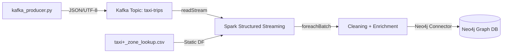

# Design Document: NYC Taxi Streaming Pipeline

## Overview

This document describes the technical design for migrating the NYC taxi batch data processing pipeline to a real-time streaming architecture. The system is composed of three main layers:

1. **Kafka Producer** — Python script that generates synthetic taxi trip records and continuously publishes them to a Kafka topic
2. **Spark Structured Streaming Consumer** — PySpark application that reads the stream, applies cleaning/enrichment/aggregations within `foreachBatch`, and persists results to Neo4j
3. **Neo4j Sink** — Persistence layer that writes micro-batches as a graph of trips and boroughs

### Key Design Decisions

| Decision | Justification |
|----------|---------------|
| No watermark | Deduplication and aggregations are performed within `foreachBatch` on each individual micro-batch |
| foreachBatch | Allows applying all cleaning, enrichment, and Neo4j write logic in a single pass per micro-batch |
| Stream-Static Join | The zones DataFrame is static (CSV), does not change during execution |
| Checkpoint with prior cleanup | Class pattern (lectures 17/18): `shutil.rmtree` before starting for development/demo |
| Neo4j Connector with Cypher | Uses `org.neo4j.spark.DataSource` with Cypher queries and `event.field` syntax (Lab6, lecture 14) |

---

## Architecture

### High-Level Architecture Diagram

```
┌─────────────────────┐         ┌─────────────────────┐         ┌─────────────────────┐
│                     │         │                     │         │                     │
│  kafka_producer.py  │────────▶│   Apache Kafka      │────────▶│  consumer.ipynb     │
│                     │  JSON   │   (kafka:9093)      │  Stream │  (PySpark SS)       │
│  - Generates trips  │  UTF-8  │   Topic: taxi-trips │         │                     │
│  - Dirty data       │         │                     │         │  foreachBatch:      │
│  - while True loop  │         └─────────────────────┘         │  ┌───────────────┐  │
│                     │                                         │  │ 1. Dedup      │  │
└─────────────────────┘                                         │  │ 2. Clean      │  │
                                                                │  │ 3. Join Zones │  │
                                ┌─────────────────────┐         │  │ 4. Aggregate  │  │
                                │                     │         │  │ 5. Write Neo4j│  │
                                │  taxi+_zone_lookup  │────────▶│  └───────────────┘  │
                                │  .csv (Static DF)   │  Join   │                     │
                                │  data/taxi_zones/   │         └──────────┬──────────┘
                                └─────────────────────┘                    │
                                                                           │ Neo4j Connector
                                                                           ▼
                                                                ┌─────────────────────┐
                                                                │                     │
                                                                │  Neo4j              │
                                                                │  (bolt://neo4j-     │
                                                                │   iteso:7687)       │
                                                                │                     │
                                                                │  (:Borough)         │
                                                                │  (:Trip)            │
                                                                │  [:PICKUP_IN]       │
                                                                │                     │
                                                                └─────────────────────┘
```

### Data Flow



---

## Components and Interfaces

### Component 1: Kafka Producer (`kafka_producer.py`)

**Responsibility**: Generate synthetic NYC taxi trip records with dirty data and continuously publish them to Kafka.

**CLI Interface**:
```python
# Location: spark/src/taxi_streaming_pipeline/kafka_producer.py
# Execution:
# python3 kafka_producer.py --broker kafka:9093 --topic taxi-trips --sleep 2
```

**Main functions**:

```python
def generate_single_taxi_record() -> dict:
    """
    Generates a single taxi trip record with 19 fields.
    Injects dirty data according to defined probabilities:
    - ~2% negative or zero trip_distance
    - ~1% negative or zero fare_amount
    - ~2% null PULocationID/DOLocationID
    - congestion_surcharge and airport_fee always None
    - ~1% duplicates (same record sent twice)
    
    Returns:
        dict with the 19 fields of the NYC taxi schema
    """

def run_producer(broker: str, topic: str, sleep_seconds: float) -> None:
    """
    Main producer loop.
    Creates KafkaProducer with JSON/UTF-8 value_serializer.
    Runs while True: generate record, send to Kafka, sleep.
    """
```

**Dependencies**: `kafka-python`, `numpy`, `faker`

### Component 2: Streaming Consumer (`consumer.ipynb`)

**Responsibility**: Read stream from Kafka, process micro-batches (clean, enrich, aggregate) and persist to Neo4j.

**Location**: `spark/src/taxi_streaming_pipeline/consumer.ipynb`

**Main functions**:

```python
def create_spark_session() -> SparkSession:
    """
    Creates Spark session with packages:
    - org.apache.spark:spark-sql-kafka-0-10_2.13:4.0.0
    - org.neo4j:neo4j-connector-apache-spark_2.13:5.3.10_for_spark_3
    Connects to spark://spark-master:7077
    """

def get_taxi_schema() -> StructType:
    """
    Returns the 19-field schema for parsing Kafka JSON messages.
    Uses SparkUtils.generate_schema() with columns_info.
    """

def load_zones_df(spark: SparkSession) -> DataFrame:
    """
    Loads static zones DataFrame from local CSV.
    Path: /opt/spark/work-dir/data/taxi_zones/taxi+_zone_lookup.csv
    Columns: LocationID, Borough, Zone, service_zone
    """

def process_micro_batch(batch_df: DataFrame, batch_id: int) -> None:
    """
    foreachBatch function that executes the full pipeline on each micro-batch:
    1. dropDuplicates()
    2. drop("congestion_surcharge", "airport_fee")
    3. dropna(subset=["PULocationID", "DOLocationID", "fare_amount"])
    4. filter(trip_distance > 0 AND fare_amount > 0)
    5. Left join with zones_df on PULocationID == LocationID
    6. Rename Borough -> Pickup_Borough
    7. Aggregate: avg(tip_amount), sum(total_amount) by (Pickup_Borough, VendorID, payment_type)
    8. Write Borough nodes to Neo4j
    9. Write Trip nodes to Neo4j
    10. Write PICKUP_IN relationships to Neo4j
    """
```

### Component 3: Neo4j Sink (integrated in `consumer.ipynb`)

**Responsibility**: Persist processed data as a graph in Neo4j.

**Write functions**:

```python
def write_borough_nodes(df: DataFrame, neo4j_options: dict) -> None:
    """
    Writes Borough nodes with deduplication via node.keys="name".
    Format: org.neo4j.spark.DataSource, labels=":Borough", mode="Overwrite"
    """

def write_trip_nodes(df: DataFrame, neo4j_options: dict) -> None:
    """
    Writes Trip nodes with processed trip properties.
    Composite key: VendorID + tpep_pickup_datetime + PULocationID + DOLocationID
    Format: org.neo4j.spark.DataSource, labels=":Trip"
    """

def write_pickup_relationships(df: DataFrame, neo4j_options: dict) -> None:
    """
    Writes PICKUP_IN relationships using custom Cypher query:
    MATCH (t:Trip {vendor_id: event.VendorID, pickup_dt: event.tpep_pickup_datetime, ...})
    MATCH (b:Borough {name: event.Pickup_Borough})
    MERGE (t)-[:PICKUP_IN]->(b)
    """
```

---

## Data Models

### Kafka Message Schema (JSON)

```json
{
  "VendorID": 1,
  "tpep_pickup_datetime": "2024-03-15 14:30:00",
  "tpep_dropoff_datetime": "2024-03-15 14:52:00",
  "passenger_count": 2,
  "trip_distance": 5.4,
  "RatecodeID": 1,
  "store_and_fwd_flag": "N",
  "PULocationID": 161,
  "DOLocationID": 237,
  "payment_type": 1,
  "fare_amount": 22.5,
  "extra": 0.5,
  "mta_tax": 0.5,
  "tip_amount": 4.75,
  "tolls_amount": 0.0,
  "improvement_surcharge": 0.3,
  "total_amount": 28.55,
  "congestion_surcharge": null,
  "airport_fee": null
}
```

### Spark Schema (StructType)

```python
columns_info = [
    ("VendorID", "long"),
    ("tpep_pickup_datetime", "timestamp"),
    ("tpep_dropoff_datetime", "timestamp"),
    ("passenger_count", "long"),
    ("trip_distance", "double"),
    ("RatecodeID", "long"),
    ("store_and_fwd_flag", "string"),
    ("PULocationID", "long"),
    ("DOLocationID", "long"),
    ("payment_type", "long"),
    ("fare_amount", "double"),
    ("extra", "double"),
    ("mta_tax", "double"),
    ("tip_amount", "double"),
    ("tolls_amount", "double"),
    ("improvement_surcharge", "double"),
    ("total_amount", "double"),
    ("congestion_surcharge", "double"),
    ("airport_fee", "double")
]
```

### Neo4j Graph Model

```
(:Borough {name: String})
(:Trip {
    vendor_id: Long,
    pickup_dt: String,
    dropoff_dt: String,
    passenger_count: Long,
    trip_distance: Double,
    fare_amount: Double,
    tip_amount: Double,
    total_amount: Double,
    payment_type: Long,
    pickup_borough: String
})
(:Trip)-[:PICKUP_IN]->(:Borough)
```

### Zones DataFrame (static CSV)

| Column | Type | Description |
|--------|------|-------------|
| LocationID | int | Taxi zone ID (1-265) |
| Borough | string | NYC district (Manhattan, Brooklyn, etc.) |
| Zone | string | Specific zone name |
| service_zone | string | Service type (Yellow Zone, Boro Zone, etc.) |

### Processed Data Schema (post-cleaning, pre-aggregation)

After cleaning and enrichment, the DataFrame contains 17 original columns (without congestion_surcharge or airport_fee) plus the `Pickup_Borough` column from the join.

### Aggregation Schema

| Column | Type | Description |
|--------|------|-------------|
| Pickup_Borough | string | Pickup borough |
| VendorID | long | Vendor ID |
| payment_type | long | Payment type |
| avg_tip | double | Average tip amount |
| total_revenue | double | Sum of total_amount |

---

## Correctness Properties

*A property is a characteristic or behavior that must remain true across all valid executions of a system — essentially, a formal statement about what the system must do. Properties serve as a bridge between human-readable specifications and machine-verifiable correctness guarantees.*

### Property 1: Valid structure of generated records

*For any* record generated by `generate_single_taxi_record()`, the record must contain exactly the 19 expected fields of the NYC taxi schema, with `congestion_surcharge` and `airport_fee` always having value `None`.


### Property 2: JSON serialization round-trip

*For any* valid taxi trip record generated, serializing it to UTF-8 encoded JSON and then deserializing it back must produce a dictionary equivalent to the original (preserving numeric types and strings).


### Property 3: Complete duplicate elimination

*For any* micro-batch containing duplicate records, after applying `dropDuplicates()`, no two identical rows must exist in the result.


### Property 4: Cleaning invariant — all surviving records are valid

*For any* micro-batch processed by the cleaning function, all records in the result must simultaneously satisfy: `PULocationID` not null, `DOLocationID` not null, `fare_amount` not null, `trip_distance > 0`, and `fare_amount > 0`.

### Property 5: Transformation pipeline output schema

*For any* DataFrame processed by the cleaning and enrichment stages, the result must not contain the columns `congestion_surcharge` or `airport_fee`, and must contain the column `Pickup_Borough` (without a residual `Borough` column).


### Property 6: Zone join correctness

*For any* trip record with a `PULocationID` that exists in the zones DataFrame, the value of `Pickup_Borough` in the join result must equal the `Borough` value corresponding to that `LocationID` in the zones table.


### Property 7: Aggregation correctness

*For any* set of trip records grouped by `(Pickup_Borough, VendorID, payment_type)`, the computed `avg_tip` value must equal the arithmetic mean of `tip_amount` in the group, and `total_revenue` must equal the sum of `total_amount` in the group.


---

## Error Handling

### Kafka Producer

| Scenario | Strategy |
|----------|----------|
| Kafka broker unavailable | KafkaProducer raises `NoBrokersAvailable`; script prints error and terminates |
| JSON serialization error | Catch `TypeError`/`ValueError`, log problematic record, continue with next |
| User interrupt (Ctrl+C) | `KeyboardInterrupt` caught in try/finally block, closes producer cleanly |

### Streaming Consumer

| Scenario | Strategy |
|----------|----------|
| Kafka broker unavailable at start | Spark raises exception when creating readStream; notebook shows clear error |
| Empty micro-batch | `foreachBatch` receives empty DataFrame; check `batch_df.isEmpty()` and return early |
| Neo4j unavailable | Connector raises exception; Spark retries according to `transaction.retries` (3 attempts) |
| Error in batch transformation | Spark Structured Streaming logs the error and continues with next micro-batch |
| Corrupted checkpoint | Cleanup with `shutil.rmtree` at start guarantees clean state for demos |
| Invalid JSON schema in message | `from_json` returns nulls for fields that don't parse; null filter discards them |

### Neo4j Sink

| Scenario | Strategy |
|----------|----------|
| Duplicate node | `node.keys` in the connector handles MERGE automatically |
| Transaction timeout | `transaction.retries: 3` retries the write |
| Null borough (no match in join) | Left join can produce `Pickup_Borough = null`; filter before writing to Neo4j |

---

## Testing Strategy

### Dual Testing Approach

This project uses two complementary levels of testing:

1. **Property-based tests (Property-Based Testing)**: Verify universal properties of the pipeline's pure logic using randomly generated data
2. **Integration tests**: Verify connectivity and end-to-end behavior with external services (Kafka, Neo4j)

### Property-Based Testing

**Library**: `hypothesis` (Python)

**Configuration**:
- Minimum 100 iterations per property test
- Each test references its property from the design document
- Tag format: `Feature: taxi-streaming-pipeline, Property {N}: {description}`

**Properties to implement**:

| Property | Function under test | Generator |
|----------|-------------------|-----------|
| 1: Record structure | `generate_single_taxi_record()` | N/A (parameterless function, executed multiple times) |
| 2: JSON round-trip | `json.dumps` + `json.loads` | Records generated by `generate_single_taxi_record()` |
| 3: Deduplication | `dropDuplicates()` in Spark | DataFrames with injected duplicate rows |
| 4: Cleaning invariant | Filter pipeline | DataFrames with mix of valid and invalid records |
| 5: Output schema | Transformation pipeline | DataFrames with full 19-column schema |
| 6: Zone join | Left join PULocationID → LocationID | Records with valid and invalid PULocationIDs |
| 7: Aggregations | groupBy + agg | Record sets with known groups |

### Integration Tests

| Test | Components | Verification |
|------|-----------|-------------|
| Kafka connectivity | Producer → Kafka | Published message appears in topic |
| Neo4j connectivity | Spark → Neo4j | Written node is queryable |
| E2E pipeline | Producer → Kafka → Spark → Neo4j | Data flows completely in < 30s |

### Unit Tests (Specific examples)

| Test | Case | Expected result |
|------|------|----------------|
| Checkpoint cleanup | Directory exists before start | Directory deleted with shutil.rmtree |
| Empty batch | foreachBatch receives empty DF | Returns without error or Neo4j write |
| Dirty data distribution | Generate 10,000 records | ~2% trip_distance ≤ 0, ~1% fare_amount ≤ 0 |

### Test Execution

```bash
# Property tests (requires hypothesis installed)
pytest tests/test_properties.py -v

# Integration tests (requires active services)
pytest tests/test_integration.py -v --timeout=60
```

---

## Key Code Patterns

### Producer Pattern (based on `src/producers/kafka_producer.py`)

```python
from kafka import KafkaProducer
import json
import time

producer = KafkaProducer(
    bootstrap_servers=broker,
    value_serializer=lambda v: json.dumps(v, default=str).encode("utf-8")
)

while True:
    record = generate_single_taxi_record()
    producer.send(topic, value=record)
    producer.flush()
    time.sleep(sleep_seconds)
```

### Consumer Pattern (based on lectures 17/18)

```python
from pathlib import Path
import shutil

# Checkpoint cleanup
checkpoint_path = "/opt/spark/work-dir/checkpoints/taxi_checkpoint"
dir_path = Path(checkpoint_path)
if dir_path.exists() and dir_path.is_dir():
    shutil.rmtree(dir_path)

# readStream from Kafka
kafka_df = spark.readStream \
    .format("kafka") \
    .option("kafka.bootstrap.servers", "kafka:9093") \
    .option("subscribe", "taxi-trips") \
    .load()

# Parse JSON
df_parsed = kafka_df.selectExpr("CAST(value AS STRING) as json_str") \
    .select(from_json(col("json_str"), taxi_schema).alias("data")) \
    .select("data.*")

# writeStream with foreachBatch
query = df_parsed.writeStream \
    .foreachBatch(process_micro_batch) \
    .option("checkpointLocation", checkpoint_path) \
    .trigger(processingTime="10 seconds") \
    .start()
```

### Neo4j Write Pattern

```python
neo4j_options = {
    "url": "bolt://neo4j-iteso:7687",
    "authentication.basic.username": "neo4j",
    "authentication.basic.password": "neo4j@1234",
    "batch.size": "5000",
    "transaction.retries": "3"
}

# Write Borough nodes
borough_df.write \
    .format("org.neo4j.spark.DataSource") \
    .mode("Overwrite") \
    .options(**neo4j_options) \
    .option("labels", ":Borough") \
    .option("node.keys", "name") \
    .save()

# Write relationships with Cypher query
rel_query = """
MATCH (t:Trip {vendor_id: event.VendorID, pickup_dt: event.tpep_pickup_datetime})
MATCH (b:Borough {name: event.Pickup_Borough})
MERGE (t)-[:PICKUP_IN]->(b)
"""

trips_df.write \
    .format("org.neo4j.spark.DataSource") \
    .mode("Append") \
    .options(**neo4j_options) \
    .option("query", rel_query) \
    .save()
```
