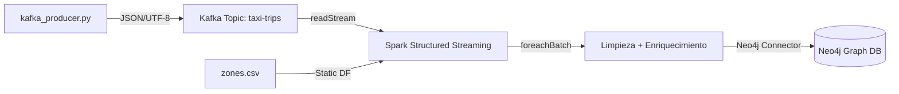

# Documento de Diseño: Pipeline de Streaming de Taxis NYC

## Resumen (Overview)

Este documento describe el diseño técnico para migrar el pipeline batch de procesamiento de datos de taxis NYC a una arquitectura de streaming en tiempo real. El sistema se compone de tres capas principales:

1. **Productor Kafka** — Script Python que genera registros sintéticos de viajes de taxi y los publica continuamente en un topic de Kafka
2. **Consumidor Spark Structured Streaming** — Aplicación PySpark que lee el stream, aplica limpieza/enriquecimiento/agregaciones dentro de `foreachBatch`, y persiste resultados en Neo4j
3. **Sink Neo4j** — Capa de persistencia que escribe micro-batches como un grafo de viajes y boroughs

### Decisiones de Diseño Clave

| Decisión | Justificación |
|----------|---------------|
| Sin watermark | La deduplicación y agregaciones se realizan dentro de `foreachBatch` sobre cada micro-batch individual |
| foreachBatch | Permite aplicar toda la lógica de limpieza, enriquecimiento y escritura a Neo4j en un solo paso por micro-batch |
| Stream-Static Join | El DataFrame de zonas es estático (CSV), no cambia durante la ejecución |
| Checkpoint con limpieza previa | Patrón de clase (lectures 17/18): `shutil.rmtree` antes de iniciar para desarrollo/demo |
| Neo4j Connector con Cypher | Usa `org.neo4j.spark.DataSource` con queries Cypher y sintaxis `event.field` (Lab6, lecture 14) |

---

## Arquitectura

### Diagrama de Arquitectura de Alto Nivel

```
┌─────────────────────┐         ┌─────────────────────┐         ┌─────────────────────┐
│                     │         │                     │         │                     │
│  kafka_producer.py  │────────▶│   Apache Kafka      │────────▶│  consumer.ipynb     │
│                     │  JSON   │   (kafka:9093)      │  Stream │  (PySpark SS)       │
│  - Genera viajes    │  UTF-8  │   Topic: taxi-trips │         │                     │
│  - Datos sucios     │         │                     │         │  foreachBatch:      │
│  - while True loop  │         └─────────────────────┘         │  ┌───────────────┐  │
│                     │                                         │  │ 1. Dedup      │  │
└─────────────────────┘                                         │  │ 2. Clean      │  │
                                                                │  │ 3. Join Zones │  │
                                ┌─────────────────────┐         │  │ 4. Aggregate  │  │
                                │                     │         │  │ 5. Write Neo4j│  │
                                │  zones.csv          │────────▶│  └───────────────┘  │
                                │  (Static DF)        │  Join   │                     │
                                │                     │         └──────────┬──────────┘
                                └─────────────────────┘                    │
                                                                           │ Neo4j Connector
                                                                           ▼
                                                                ┌─────────────────────┐
                                                                │                     │
                                                                │  Neo4j              │
                                                                │  (bolt://neo4j-     │
                                                                │   iteso:7687)       │
                                                                │                     │
                                                                │  (:Borough)         │
                                                                │  (:Trip)            │
                                                                │  [:PICKUP_IN]       │
                                                                │                     │
                                                                └─────────────────────┘
```

### Flujo de Datos



---

## Componentes e Interfaces

### Componente 1: Productor Kafka (`kafka_producer.py`)

**Responsabilidad**: Generar registros sintéticos de viajes de taxi NYC con datos sucios y publicarlos continuamente en Kafka.

**Interfaz CLI**:
```python
# Ejecución:
# python3 kafka_producer.py --broker kafka:9093 --topic taxi-trips --sleep 2
```

**Funciones principales**:

```python
def generate_single_taxi_record() -> dict:
    """
    Genera un único registro de viaje de taxi con 19 campos.
    Inyecta datos sucios según las probabilidades definidas:
    - ~2% trip_distance negativa o cero
    - ~1% fare_amount negativa o cero
    - ~2% PULocationID/DOLocationID nulos
    - congestion_surcharge y airport_fee siempre None
    - ~1% duplicados (se envía el mismo registro dos veces)
    
    Returns:
        dict con los 19 campos del esquema de taxi NYC
    """

def run_producer(broker: str, topic: str, sleep_seconds: float) -> None:
    """
    Bucle principal del productor.
    Crea KafkaProducer con value_serializer JSON/UTF-8.
    Ejecuta while True: genera registro, envía a Kafka, duerme.
    """
```

**Dependencias**: `kafka-python`, `numpy`, `faker`

### Componente 2: Consumidor Streaming (`consumer.ipynb`)

**Responsabilidad**: Leer stream de Kafka, procesar micro-batches (limpiar, enriquecer, agregar) y persistir en Neo4j.

**Funciones principales**:

```python
def create_spark_session() -> SparkSession:
    """
    Crea sesión Spark con paquetes:
    - org.apache.spark:spark-sql-kafka-0-10_2.13:4.0.0
    - org.neo4j:neo4j-connector-apache-spark_2.13:5.3.10_for_spark_3
    Conecta a spark://spark-master:7077
    """

def get_taxi_schema() -> StructType:
    """
    Retorna el esquema de 19 campos para parsear mensajes JSON de Kafka.
    Usa SparkUtils.generate_schema() con columns_info.
    """

def load_zones_df(spark: SparkSession) -> DataFrame:
    """
    Carga DataFrame estático de zonas desde CSV.
    Columnas: LocationID, Borough, Zone, service_zone
    """

def process_micro_batch(batch_df: DataFrame, batch_id: int) -> None:
    """
    Función foreachBatch que ejecuta todo el pipeline sobre cada micro-batch:
    1. dropDuplicates()
    2. drop("congestion_surcharge", "airport_fee")
    3. dropna(subset=["PULocationID", "DOLocationID", "fare_amount"])
    4. filter(trip_distance > 0 AND fare_amount > 0)
    5. Left join con zones_df en PULocationID == LocationID
    6. Renombrar Borough -> Pickup_Borough
    7. Agregar: avg(tip_amount), sum(total_amount) por (Pickup_Borough, VendorID, payment_type)
    8. Escribir nodos Borough en Neo4j
    9. Escribir nodos Trip en Neo4j
    10. Escribir relaciones PICKUP_IN en Neo4j
    """
```

### Componente 3: Sink Neo4j (integrado en `consumer.ipynb`)

**Responsabilidad**: Persistir datos procesados como grafo en Neo4j.

**Funciones de escritura**:

```python
def write_borough_nodes(df: DataFrame, neo4j_options: dict) -> None:
    """
    Escribe nodos Borough con deduplicación por node.keys="name".
    Formato: org.neo4j.spark.DataSource, labels=":Borough", mode="Overwrite"
    """

def write_trip_nodes(df: DataFrame, neo4j_options: dict) -> None:
    """
    Escribe nodos Trip con propiedades del viaje procesado.
    Clave compuesta: VendorID + tpep_pickup_datetime + PULocationID + DOLocationID
    Formato: org.neo4j.spark.DataSource, labels=":Trip"
    """

def write_pickup_relationships(df: DataFrame, neo4j_options: dict) -> None:
    """
    Escribe relaciones PICKUP_IN usando query Cypher personalizada:
    MATCH (t:Trip {vendor_id: event.VendorID, pickup_dt: event.tpep_pickup_datetime, ...})
    MATCH (b:Borough {name: event.Pickup_Borough})
    MERGE (t)-[:PICKUP_IN]->(b)
    """
```

---

## Modelos de Datos

### Esquema de Mensaje Kafka (JSON)

```json
{
  "VendorID": 1,
  "tpep_pickup_datetime": "2024-03-15 14:30:00",
  "tpep_dropoff_datetime": "2024-03-15 14:52:00",
  "passenger_count": 2,
  "trip_distance": 5.4,
  "RatecodeID": 1,
  "store_and_fwd_flag": "N",
  "PULocationID": 161,
  "DOLocationID": 237,
  "payment_type": 1,
  "fare_amount": 22.5,
  "extra": 0.5,
  "mta_tax": 0.5,
  "tip_amount": 4.75,
  "tolls_amount": 0.0,
  "improvement_surcharge": 0.3,
  "total_amount": 28.55,
  "congestion_surcharge": null,
  "airport_fee": null
}
```

### Esquema Spark (StructType)

```python
columns_info = [
    ("VendorID", "long"),
    ("tpep_pickup_datetime", "timestamp"),
    ("tpep_dropoff_datetime", "timestamp"),
    ("passenger_count", "long"),
    ("trip_distance", "double"),
    ("RatecodeID", "long"),
    ("store_and_fwd_flag", "string"),
    ("PULocationID", "long"),
    ("DOLocationID", "long"),
    ("payment_type", "long"),
    ("fare_amount", "double"),
    ("extra", "double"),
    ("mta_tax", "double"),
    ("tip_amount", "double"),
    ("tolls_amount", "double"),
    ("improvement_surcharge", "double"),
    ("total_amount", "double"),
    ("congestion_surcharge", "double"),
    ("airport_fee", "double")
]
```

### Modelo de Grafo Neo4j

```
(:Borough {name: String})
(:Trip {
    vendor_id: Long,
    pickup_dt: String,
    dropoff_dt: String,
    passenger_count: Long,
    trip_distance: Double,
    fare_amount: Double,
    tip_amount: Double,
    total_amount: Double,
    payment_type: Long,
    pickup_borough: String
})
(:Trip)-[:PICKUP_IN]->(:Borough)
```

### DataFrame de Zonas (CSV estático)

| Columna | Tipo | Descripción |
|---------|------|-------------|
| LocationID | int | ID de zona de taxi (1-265) |
| Borough | string | Distrito de NYC (Manhattan, Brooklyn, etc.) |
| Zone | string | Nombre de la zona específica |
| service_zone | string | Tipo de servicio (Yellow Zone, Boro Zone, etc.) |

### Esquema de Datos Procesados (post-limpieza, pre-agregación)

Después de limpieza y enriquecimiento, el DataFrame contiene 17 columnas originales (sin congestion_surcharge ni airport_fee) más la columna `Pickup_Borough` del join.

### Esquema de Agregaciones

| Columna | Tipo | Descripción |
|---------|------|-------------|
| Pickup_Borough | string | Borough de pickup |
| VendorID | long | ID del proveedor |
| payment_type | long | Tipo de pago |
| avg_tip | double | Promedio de propina |
| total_revenue | double | Suma de total_amount |

---

## Propiedades de Correctitud (Correctness Properties)

*Una propiedad es una característica o comportamiento que debe mantenerse verdadero en todas las ejecuciones válidas de un sistema — esencialmente, una declaración formal sobre lo que el sistema debe hacer. Las propiedades sirven como puente entre especificaciones legibles por humanos y garantías de correctitud verificables por máquina.*

### Property 1: Estructura válida de registros generados

*Para cualquier* registro generado por `generate_single_taxi_record()`, el registro debe contener exactamente los 19 campos esperados del esquema de taxi NYC, con `congestion_surcharge` y `airport_fee` siempre con valor `None`.

**Validates: Requirements 1.1, 1.2**

### Property 2: Round-trip de serialización JSON

*Para cualquier* registro válido de viaje de taxi generado, serializarlo a JSON codificado en UTF-8 y luego deserializarlo de vuelta debe producir un diccionario equivalente al original (preservando tipos numéricos y strings).

**Validates: Requirements 1.3, 2.3**

### Property 3: Eliminación completa de duplicados

*Para cualquier* micro-batch que contenga registros duplicados, después de aplicar `dropDuplicates()`, no deben existir dos filas idénticas en el resultado.

**Validates: Requirements 3.1**

### Property 4: Invariante de limpieza — todos los registros sobrevivientes son válidos

*Para cualquier* micro-batch procesado por la función de limpieza, todos los registros en el resultado deben satisfacer simultáneamente: `PULocationID` no nulo, `DOLocationID` no nulo, `fare_amount` no nulo, `trip_distance > 0`, y `fare_amount > 0`.

**Validates: Requirements 3.3, 3.4**

### Property 5: Esquema de salida del pipeline de transformación

*Para cualquier* DataFrame procesado por las etapas de limpieza y enriquecimiento, el resultado no debe contener las columnas `congestion_surcharge` ni `airport_fee`, y debe contener la columna `Pickup_Borough` (sin columna `Borough` residual).

**Validates: Requirements 3.2, 4.2**

### Property 6: Correctitud del join con zonas

*Para cualquier* registro de viaje con un `PULocationID` que existe en el DataFrame de zonas, el valor de `Pickup_Borough` en el resultado del join debe ser igual al valor de `Borough` correspondiente a ese `LocationID` en la tabla de zonas.

**Validates: Requirements 4.1**

### Property 7: Correctitud de agregaciones

*Para cualquier* conjunto de registros de viaje agrupados por `(Pickup_Borough, VendorID, payment_type)`, el valor calculado de `avg_tip` debe ser igual a la media aritmética de `tip_amount` del grupo, y `total_revenue` debe ser igual a la suma de `total_amount` del grupo.

**Validates: Requirements 7.1, 7.2**

---

## Manejo de Errores

### Productor Kafka

| Escenario | Estrategia |
|-----------|-----------|
| Kafka broker no disponible | KafkaProducer lanza `NoBrokersAvailable`; el script imprime error y termina |
| Error de serialización JSON | Capturar `TypeError`/`ValueError`, loguear registro problemático, continuar con siguiente |
| Interrupción del usuario (Ctrl+C) | `KeyboardInterrupt` capturado en bloque try/finally, cierra producer limpiamente |

### Consumidor Streaming

| Escenario | Estrategia |
|-----------|-----------|
| Kafka broker no disponible al inicio | Spark lanza excepción al crear readStream; el notebook muestra error claro |
| Micro-batch vacío | `foreachBatch` recibe DataFrame vacío; verificar `batch_df.isEmpty()` y retornar temprano |
| Neo4j no disponible | El conector lanza excepción; Spark reintenta según `transaction.retries` (3 intentos) |
| Error en transformación de un batch | Spark Structured Streaming registra el error y continúa con el siguiente micro-batch |
| Checkpoint corrupto | Limpieza con `shutil.rmtree` al inicio garantiza estado limpio para demos |
| Esquema JSON inválido en mensaje | `from_json` retorna nulls para campos que no parsean; el filtro de nulls los descarta |

### Neo4j Sink

| Escenario | Estrategia |
|-----------|-----------|
| Nodo duplicado | `node.keys` en el conector maneja MERGE automáticamente |
| Timeout de transacción | `transaction.retries: 3` reintenta la escritura |
| Borough nulo (no match en join) | Left join puede producir `Pickup_Borough = null`; filtrar antes de escribir a Neo4j |

---

## Estrategia de Testing

### Enfoque Dual de Testing

Este proyecto utiliza dos niveles complementarios de testing:

1. **Tests de propiedades (Property-Based Testing)**: Verifican propiedades universales de la lógica pura del pipeline usando datos generados aleatoriamente
2. **Tests de integración**: Verifican la conectividad y comportamiento end-to-end con servicios externos (Kafka, Neo4j)

### Property-Based Testing

**Librería**: `hypothesis` (Python)

**Configuración**:
- Mínimo 100 iteraciones por test de propiedad
- Cada test referencia su propiedad del documento de diseño
- Formato de tag: `Feature: taxi-streaming-pipeline, Property {N}: {descripción}`

**Propiedades a implementar**:

| Property | Función bajo test | Generador |
|----------|------------------|-----------|
| 1: Estructura de registros | `generate_single_taxi_record()` | N/A (función sin parámetros, se ejecuta múltiples veces) |
| 2: Round-trip JSON | `json.dumps` + `json.loads` | Registros generados por `generate_single_taxi_record()` |
| 3: Deduplicación | `dropDuplicates()` en Spark | DataFrames con filas duplicadas inyectadas |
| 4: Invariante de limpieza | Pipeline de filtros | DataFrames con mezcla de registros válidos e inválidos |
| 5: Esquema de salida | Pipeline de transformación | DataFrames con esquema completo de 19 columnas |
| 6: Join con zonas | Left join PULocationID → LocationID | Registros con PULocationIDs válidos e inválidos |
| 7: Agregaciones | groupBy + agg | Conjuntos de registros con grupos conocidos |

### Tests de Integración

| Test | Componentes | Verificación |
|------|-------------|-------------|
| Conectividad Kafka | Producer → Kafka | Mensaje publicado aparece en topic |
| Conectividad Neo4j | Spark → Neo4j | Nodo escrito es consultable |
| Pipeline E2E | Producer → Kafka → Spark → Neo4j | Dato fluye completo en < 30s |

### Tests Unitarios (Ejemplos específicos)

| Test | Caso | Resultado esperado |
|------|------|-------------------|
| Checkpoint cleanup | Directorio existe antes de iniciar | Directorio eliminado con shutil.rmtree |
| Batch vacío | foreachBatch recibe DF vacío | Retorna sin error ni escritura a Neo4j |
| Distribución de datos sucios | Generar 10,000 registros | ~2% trip_distance ≤ 0, ~1% fare_amount ≤ 0 |

### Ejecución de Tests

```bash
# Tests de propiedades (requiere hypothesis instalado)
pytest tests/test_properties.py -v

# Tests de integración (requiere servicios activos)
pytest tests/test_integration.py -v --timeout=60
```

---

## Patrones de Código Clave

### Patrón del Productor (basado en `src/producers/kafka_producer.py`)

```python
from kafka import KafkaProducer
import json
import time

producer = KafkaProducer(
    bootstrap_servers=broker,
    value_serializer=lambda v: json.dumps(v, default=str).encode("utf-8")
)

while True:
    record = generate_single_taxi_record()
    producer.send(topic, value=record)
    producer.flush()
    time.sleep(sleep_seconds)
```

### Patrón del Consumidor (basado en lectures 17/18)

```python
from pathlib import Path
import shutil

# Limpieza de checkpoint
checkpoint_path = "/opt/spark/work-dir/checkpoints/taxi_checkpoint"
dir_path = Path(checkpoint_path)
if dir_path.exists() and dir_path.is_dir():
    shutil.rmtree(dir_path)

# readStream desde Kafka
kafka_df = spark.readStream \
    .format("kafka") \
    .option("kafka.bootstrap.servers", "kafka:9093") \
    .option("subscribe", "taxi-trips") \
    .load()

# Parse JSON
df_parsed = kafka_df.selectExpr("CAST(value AS STRING) as json_str") \
    .select(from_json(col("json_str"), taxi_schema).alias("data")) \
    .select("data.*")

# writeStream con foreachBatch
query = df_parsed.writeStream \
    .foreachBatch(process_micro_batch) \
    .option("checkpointLocation", checkpoint_path) \
    .trigger(processingTime="10 seconds") \
    .start()
```

### Patrón de Escritura Neo4j (basado en Lab6 y lecture 14)

```python
neo4j_options = {
    "url": "bolt://neo4j-iteso:7687",
    "authentication.basic.username": "neo4j",
    "authentication.basic.password": "neo4j@1234",
    "batch.size": "5000",
    "transaction.retries": "3"
}

# Escribir nodos Borough
borough_df.write \
    .format("org.neo4j.spark.DataSource") \
    .mode("Overwrite") \
    .options(**neo4j_options) \
    .option("labels", ":Borough") \
    .option("node.keys", "name") \
    .save()

# Escribir relaciones con Cypher query
rel_query = """
MATCH (t:Trip {vendor_id: event.VendorID, pickup_dt: event.tpep_pickup_datetime})

MATCH (b:Borough {name: event.Pickup_Borough})
MERGE (t)-[:PICKUP_IN]->(b)
"""

trips_df.write \
    .format("org.neo4j.spark.DataSource") \
    .mode("Append") \
    .options(**neo4j_options) \
    .option("query", rel_query) \
    .save()
```

